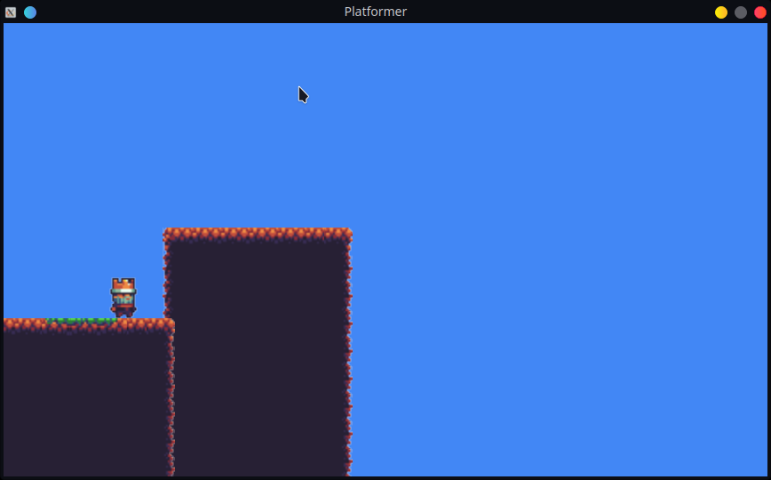

# Simple platformer

2d platformer game written in Go using [SDL](https://github.com/veandco/go-sdl2).
**Work in progress**

## How to run it
You need to SDL2 packages first. [Here](https://github.com/veandco/go-sdl2#requirements) is a description.
Then, you can simply use `go build`.

## Credits
Images source: [opengameart.org](https://opengameart.org/content/a-platformer-in-the-forest)
Big thanks to [Buch](https://opengameart.org/users/buch)